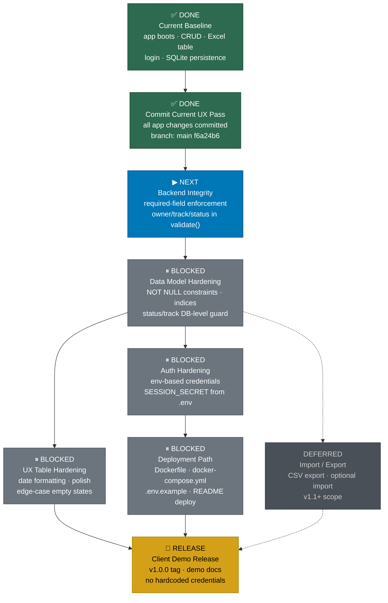

# V1 Serialized Build Roadmap DAG

## Section 1 — Current Baseline

The app is confirmed working as of commit `f6a24b6` (working tree clean).

| Item | State |
|------|-------|
| Server | Express + node:sqlite + bcrypt + express-session, runs on :3000 |
| Auth | Session cookie login; users: admin/admin123, vasu/vasu123 |
| CRUD | GET /api/rows, POST /api/rows, PUT /api/rows/:id, DELETE /api/rows/:id |
| Persistence | SQLite (data.db), WAL mode, auto-seeded, survives restart |
| Frontend | 14-column Excel-like Team Summary table (Sheet-2 contract column order) |
| Client validation | Required fields enforced client-side: owner, track, title, status |
| Prototype | Preserved untouched in prototypes/execution-table-app/ |
| Node requirement | ≥ 22.5 (node:sqlite experimental) |

Completed capabilities (both RELEASE_APPROVED in ai/state_registry.json):
- `promote-execution-table-v1-scaffold` — bootstrapped app/ from prototype
- `excel-like-team-summary-view` — Sheet-2 column order, dense grid, filters, modal helper text

Latest commit: `f6a24b6 feat: align app with team experiment summary sheet` — working tree clean at roadmap creation.

---

## Section 2 — Mermaid DAG



---

## Section 3 — Capability Queue

| Node | Capability Name | Purpose | Allowed Surfaces | Verification Gate | Depends On | Release Impact |
|------|-----------------|---------|-----------------|-------------------|------------|----------------|
| N0 | Current Baseline | Confirmed working state: CRUD, auth, Excel table, SQLite persistence | — (already done) | App boots on :3000, login works, full CRUD, data survives restart | — | Foundation for all subsequent work |
| N1 | Commit Current UX Pass | All app changes committed to main; clean working tree at f6a24b6 | — (already done) | `git status` shows clean; f6a24b6 tagged | N0 | Serializes baseline before feature work begins |
| N2 | Backend Integrity | Add required-field enforcement to `validate()`: owner, track, status must be non-empty on POST (PUT exempted) | app/server.js | POST /api/rows with missing owner → 400; POST with all required fields → 201 | N1 | Closes R-01 (API bypass risk); required before data model changes |
| N3 | Data Model Hardening | Add NOT NULL constraints on owner/track/status; add index on status and track; verify target_end_date stores as ISO text | app/db.js, app/server.js (migration helper only) | Schema reflects NOT NULL; filter queries use index; date column stores ISO strings | N2 | Closes R-04 (partial); required before auth or UX hardening |
| N4 | UX Table Hardening | Date column formatting (ISO → human-readable), status badge alignment, edge-case empty state, filter dropdown re-population after create/edit | app/public/app.js, app/public/style.css | Dates render human-readable; empty state shows placeholder; filters repopulate after modal submit | N3 | Improves demo polish; required before release |
| N5 | Auth Hardening | Move SESSION_SECRET, ADMIN_PASS, VASU_PASS to `.env`; update db.js seed to read from env; document env vars in README | app/db.js, app/server.js, app/.env.example, app/README.md | App starts with env vars set; hardcoded credentials removed from source; README covers setup | N3 | Closes R-02, R-03; required before deployment path |
| N6 | Import / Export | CSV export of filtered view; optional CSV import from Excel (deferred — non-critical path) | app/server.js, app/public/app.js, app/public/style.css | Export button produces valid CSV; import parses and loads rows | N3 | Deferred to v1.1+; not blocking demo release |
| N7 | Deployment Path | Dockerfile + docker-compose.yml; `.env.example`; README deployment section | app/Dockerfile, app/docker-compose.yml, app/.env.example, app/README.md | `docker compose up` starts app on :3000; `.env.example` documents all required vars | N5 | Closes R-05; required before release |
| N8 | Client Demo Release | Tag v1.0.0; update README with demo instructions; confirm no hardcoded credentials in shipped image | git tag, app/README.md (release notes) | v1.0.0 tag exists; README has demo instructions; no hardcoded creds in image | N4 + N7 | Ships the product |

---

## Section 4 — Critical Path

```
Commit Baseline ✅
  → Backend Integrity
    → Data Model Hardening
      → Auth Hardening
        → Deployment Path
          → Client Demo Release 🚀
```

> **Note:** UX Table Hardening (N4) runs in parallel with Auth Hardening (N5) after Data Model Hardening (N3) completes. Both N4 and N7 must complete before Client Demo Release (N8) — N4 for demo polish and N7 for a deployable image.

---

## Section 5 — Non-Critical / Later Work

1. **Import / Export** — users can manually enter rows; bulk load from Excel and CSV export deferred to post-demo (v1.1+) to keep v1 scope tight.
2. **Advanced filters (multi-select, date range)** — current AND-based status/track/type filters are sufficient for the v1 team; multi-select and date range are a post-demo enhancement.
3. **Dashboards** — out of v1 scope per Product Intent Brief (PIB); the table editor is the sole read/write surface for v1.
4. **Approval workflow** — no acceptance lifecycle in v1 (CON-002 open; CTX-10 deferred); single-step manual status updates cover the demo use case.
5. **Agents / AI automation** — future direction per AFD-01; not v1 scope and not required for the client demo.
6. **IoT / digital twin** — an NDT-SaaS concern explicitly separated from this execution platform; no overlap with v1.
7. **Role-based access control** — single-team v1 with two dev users is sufficient; RBAC is a post-v1 concern when multiple teams onboard.

---

## Section 6 — Next Immediate Capability

**Next capability: Backend Required Field Enforcement**
**Feature slug:** `backend-required-field-enforcement`
**Reason:** `validate()` in `app/server.js` currently enforces only `title` is non-empty.
`owner`, `track`, and `status` are required per the schema (`ROW_FIELDS` required: true)
but a raw API caller (curl, Postman) can POST a row with empty owner/track and bypass all
client-side checks. This closes risk R-01 from the recon.
**Allowed surfaces:** app/server.js only (validate() function, POST handler).
**Verification:** POST /api/rows with missing owner → 400. POST with all required → 201.
