# Execution Platform Build Map

## Status
draft

## Layer
Cross-layer Build Map (navigation aid)

## Version
0.1.0

## Upstream Authority
Reflects the approved SDLC corpus as of 2026-06-09: Context Synthesis v0.3.0
(CTX-SYN-001; CTX-01…CTX-14), Product Intent Brief (approved L1 review
2026-06-09), Actor/Role Catalog (draft 0.1.0), ADR-000 (accepted). This
document is a read-only reflection of those artifacts — it does not originate
any requirements, decisions, or constraints.

## Downstream Consumers
None. This is a navigation aid only. No authority flows from it to any L0–L5
artifact. Downstream artifacts must trace to their own upstream authorities,
not to this document.

## Purpose
**Visual clarity only — not product authority.** This document is a navigation aid. It
contains no requirements, no domain model, no architecture decisions, and no technology
choices. No authority flows from it to any L0–L5 artifact. It is updated as the corpus
advances.

---

## 1. Plain-English Current State

- **Product intent is approved.** v1 = simple controlled table editor for
  experiment/work-item/task rows; separate app from NDT-SaaS; no escalation, no
  approval workflow, no dashboard, no agents.
- **v1 scope is locked.** Create, edit, and list rows with a shared column set.
  Mandatory-field policy and exact access-control design remain open — both are PRD
  inputs, not intent blockers.
- **Actor Catalog is draft and deferred.** OQ-02 (approval authority) and OQ-10
  (dashboard readership) are open, but neither is a blocker for the v1 build path —
  v1 does not model approval workflow or a broad reader class.
- **No product code exists.** INV-002 holds; `src/` and `app/` do not exist. The
  governance gate does not lift until the minimal artifact chain is approved.
- **Next required artifact: Minimal V1 PRD from the workbook.** Turn the Excel column
  set and row conventions into a buildable table-editor spec.

---

## 2. Build Map

```mermaid
flowchart TD
    classDef done fill:#2d6a4f,color:#fff,stroke:#1b4332
    classDef here fill:#0077b6,color:#fff,stroke:#023e8a
    classDef deferred fill:#6c757d,color:#fff,stroke:#495057
    classDef nxt fill:#e76f51,color:#fff,stroke:#ae2012
    classDef buildstart fill:#d62828,color:#fff,stroke:#6a040f

    A["A ✅ DONE\nEvidence and Context\nSRC-001…SRC-006 · RES-001\nCTX-01…CTX-14 approved"]:::done

    B["B ✅ DONE\nProduct Intent\nL1 Intent Recon ✅ approved\nProduct Intent Brief ✅ approved\nv1 = simple table editor"]:::done

    CURR["▶ CURRENT STATE ◀\nPIB approved · Actor Catalog draft\nready to author Minimal V1 PRD"]:::here

    C["C ⚙ DEFERRED\nActor Catalog\nOQ-02 approval authority open\nOQ-10 dashboard readership open\nNOT a v1 build blocker"]:::deferred

    D["D ← NEXT\nMinimal V1 PRD\ncolumns · row types · create/edit/list\nbasic access stance\nno escalation · no approval\nno dashboard · no agents"]:::nxt

    E["E DEFERRED\nStack and Scaffold Decision\nfrontend + backend + db choice\nL3 concern — not yet decided"]:::deferred

    F["F DEFERRED\nMinimal L2/L3\nbehavior + structure spec\nonly what v1 needs"]:::deferred

    G["G DEFERRED\nL4 Verification\nacceptance criteria bound to PRD\nsmoke test strategy"]:::deferred

    H["H ← BUILD START\nTraceability closes end-to-end\nINV-002 gate lifts\nsrc/ and app/ now permitted"]:::buildstart

    I["I DEFERRED\nOS Execution Directive\ncompile-spec → generate-tasks\n→ execution-supervisor"]:::deferred

    J["J DEFERRED\nProduct Code Created\nv1 table editor implemented\nverified · journaled"]:::deferred

    A --> B
    B --> CURR
    CURR --> D
    CURR -.-> C
    C -. "frozen\nnot a build blocker" .-> D
    D --> E
    E --> F
    F --> G
    G --> H
    H --> I
    I --> J
```

---

## 3. Build Start Rule

**Build starts only when Minimal V1 PRD + minimal structure/verification spec are
approved and traceability closes end-to-end.**

Because v1 is a tiny table editor, the remaining artifact path must be
**compressed and build-oriented**, not enterprise-heavy. The goal is the thinnest
defensible artifact chain that unlocks INV-002 — not a full L2–L4 corpus.

| Gate | Condition |
|---|---|
| INV-002 lifts | L4 Verification is approved; traceability closes from PRD requirements to acceptance criteria |
| L5 Build opens | OS pipeline runs: compile-spec → generate-tasks → execution-supervisor |
| Code scaffold | `src/` / `app/` created; v1 table editor implemented |

The Actor Catalog (node C), approval authority (OQ-02), and dashboard readership
(OQ-10) are **not on the critical path** to the build start gate. They are deferred
without penalty.

---

## 4. Frozen / Deferred Items

The following are **not required before v1 scaffold and build begin**. They are frozen
and will be addressed in a future release or a post-v1 PRD revision.

| Item | Why deferred |
|---|---|
| Approval / acceptance authority (OQ-02) | v1 has no approval workflow; execution-only statuses suffice |
| Dashboard readership beyond Vijay (OQ-10) | v1 is a table editor, not a dashboard product |
| Lead role (CACT-02) | Authority semantics unresolved; not needed for table-editor actor set |
| Approver / acceptor role (CACT-03) | No acceptance lifecycle in v1 (CON-002 held open) |
| Dashboard actor (CACT-01) | Dashboard is future direction; not v1 scope |
| Agent actor (AFD-01) | Operations agents are future direction; not v1 scope |
| Escalation workflow | CTX-10: explicitly out of v1 scope |
| Full Actor Catalog approval | Can proceed to PRD with two evidenced v1 actors (ACT-01, ACT-02) |

---

## 5. Immediate Next Directive

**Directive: Minimal V1 PRD from Workbook**

**Purpose:** Turn the Excel column set, row conventions, and v1 scope (CTX-09, CTX-13)
into a buildable table-editor specification with stable requirement IDs.

**Must include:**
- The shared column set derived from SRC-002 (workbook columns as-practiced)
- Row types: experiment, work-item, task (sharing the column set)
- Mandatory-field policy — decided here, not deferred further
- Create / edit / list row behavior
- Basic access stance (simple pattern per CTX-12; exact mechanism TBD at L3)
- OPS Cloud track classification as product context (CTX-14)

**Must NOT include:**
- Escalation workflow (CTX-10)
- Approval / acceptance lifecycle (CON-002)
- Dashboard or management read surface (future direction)
- Operations agent interactions (AFD-01; future direction)
- Technology selection (deferred to E — Stack & Scaffold Decision)
- Permission matrix or auth implementation (deferred to L3)
- Any content not grounded in approved CTX assertions or the approved PIB
